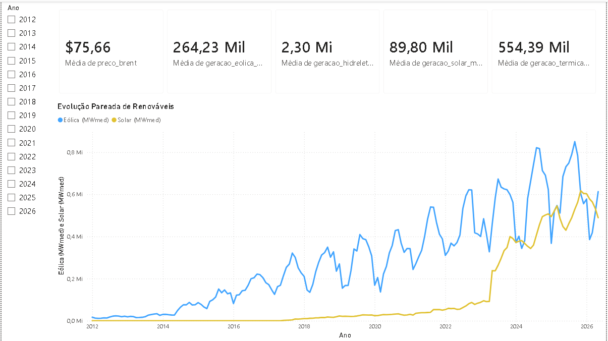
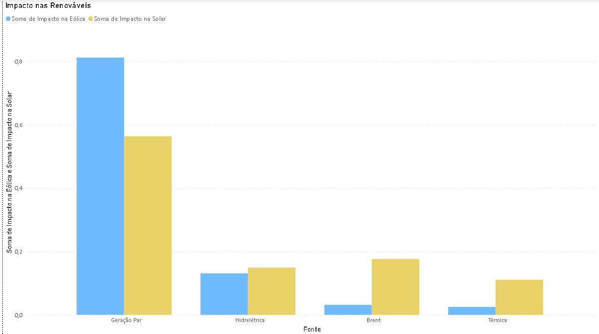
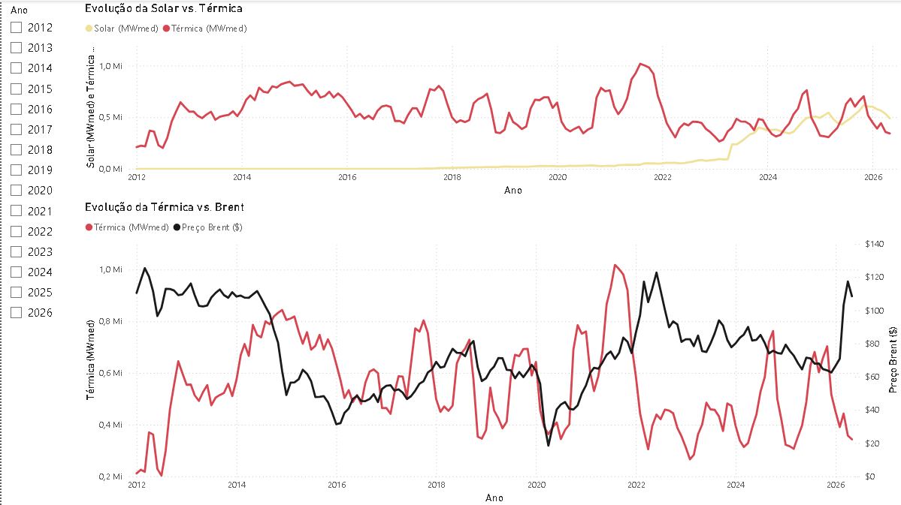
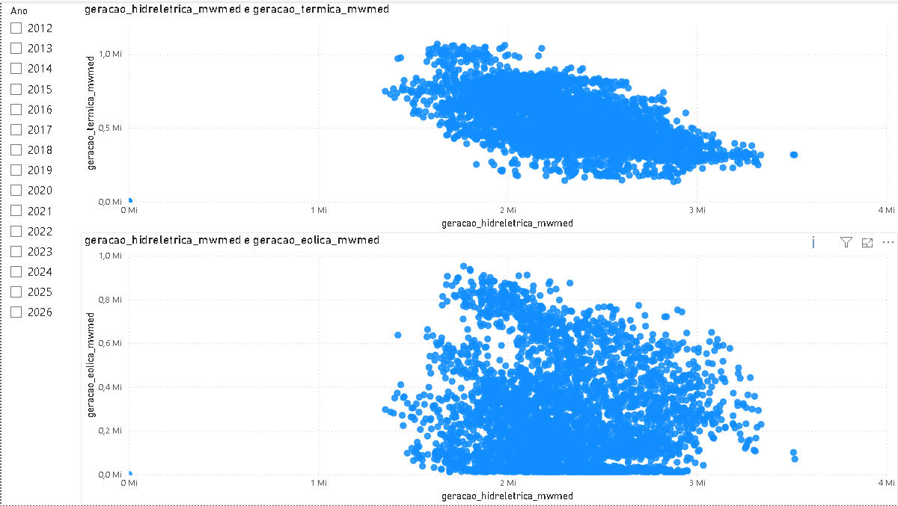

# Análise da Correlação entre os Preços do Petróleo e a Atratividade de Investimentos em Geração Solar e Eólica

> 📄 **Artigo Completo:** Leia o estudo teórico e conclusões detalhadas no arquivo [Artigo de Mercado V. Finale.pdf](Artigo%20de%20Mercado%20V.%20Finale.pdf)

Pipeline analítico de dados que integra séries temporais diárias do **Operador Nacional do Sistema Elétrico (ONS)** com cotações internacionais do **Petróleo Bruto tipo Brent (EIA/IPEADATA)** no período de 2012 a 2026. O projeto engloba modelagem relacional em SQL, algoritmos de *Machine Learning* (*Random Forest Regressor*) em Python para cálculo de *Feature Importance* e desenvolvimento de painel executivo interativo no Power BI.

---

## 📌 Indicadores Históricos Consolidados (2012–2026)

- **Cotação Média do Petróleo Brent (FOB):** US$ 75,66 / barril
- **Geração Hidrelétrica Média:** 2,30 Mi MWmed
- **Geração Termelétrica Média:** 554,39 Mil MWmed
- **Geração Eólica Média:** 264,23 Mil MWmed
- **Geração Solar Centralizada Média:** 89,80 Mil MWmed

---

## 🛠️ Stack Tecnológica

- **SQL (SQLite):** Agregações diárias e junções relacionais entre bases ONS e IPEADATA.
- **Python (Google Colab):** Tratamento de dados, interpolação temporal e modelagem com Scikit-Learn.
- **Business Intelligence (Power BI):** Modelagem dimensional, métricas DAX e relatórios com filtros temporais dinâmicos.
- **Fontes de Dados:** ONS (Dados Abertos) e IPEADATA / EIA (Série EIA366_PBRENT366).

---

## 🧠 Modelagem Estatística e Machine Learning: Feature Importance

Foram ajustados dois modelos de **Random Forest Regressor** (1000 estimadores) para quantificar o peso relativo de cada variável física e macroeconômica na geração renovável:

| Variável Explicativa | Impacto na Geração Solar (%) | Impacto na Geração Eólica (%) |
|---|:---:|:---:|
| **Geração Renovável Par (Eólica / Solar)** | **56,37%** | **81,21%** |
| **Preço do Petróleo Brent (US$)** | **17,62%** | **3,16%** |
| **Geração Hidrelétrica (MWmed)** | **14,91%** | **13,11%** |
| **Geração Termelétrica (MWmed)** | **11,10%** | **2,52%** |

> **Diagnóstico:** A complementaridade entre solar e eólica exerce a maior dominância estatística na matriz. As variações do Brent impactam principalmente a curva solar (17,62%), enquanto o parque hidrelétrico atua como lastro de regulação estável para ambas as fontes (~13% a 15%).

---

## 📊 Visualizações do Dashboard Executivo

### 1. Evolução Pareada das Renováveis
Mapeamento da evolução temporal de geração média entre as fontes solar e eólica.

### 2. Decomposição de Feature Importance
Pesos de importância obtidos via Random Forest para as fontes solar e eólica.

### 3. Dinâmica Térmica: Impacto Solar e Preço do Brent
Análise de despacho térmico em contraponto à expansão solar e às cotações internacionais do barril de petróleo.

### 4. Complementariedade Hídrica vs. Térmica e Eólica
Diagramas de dispersão demonstrando a correlação operativa entre bacias hidrográficas, suporte térmico e geração eólica.

---

## 📁 Estrutura do Repositório

* `01_evolucao_renovaveis.png`
* `02_feature_importance.png`
* `03_termica_solar_brent.png`
* `04_hidro_termica_eolica.png`
* `Artigo de Mercado V. Finale.pdf`
* `Dashboard Artigo de Mercado de Energia.pbix`
* `Mercado_de_Energia_V_f.ipynb`
* `README.md`
* `dataset_final_202605181842.csv`
* `queries.sql`

---

## 🚀 Como Executar e Navegar pelo Projeto

1. **Leitura do Artigo (Teoria e Negócios):**
   * Abra o arquivo `Artigo de Mercado V. Finale.pdf` diretamente no repositório para ler o estudo completo.

2. **Pipeline de Dados (SQL):**
   * As instruções de extração, tratamento e junção de bases estão documentadas no arquivo `queries.sql`.

3. **Execução do Modelo (Python):**
   * Abra o arquivo `Mercado_de_Energia_V_f.ipynb` para visualizar a limpeza dos dados (`dataset_final_202605181842.csv`) e o treinamento do Random Forest.

4. **Navegação no Dashboard (Power BI):**
   * Baixe e abra o arquivo `Dashboard Artigo de Mercado de Energia.pbix` no **Power BI Desktop** para explorar os relatórios e utilizar os filtros interativos.

## 👥 Autores e Orientação

Este projeto e o artigo correspondente foram desenvolvidos em colaboração:
- **Lucas Silva Ribeiro:** Engenharia de Dados, Modelagem ML e Dashboard
- **Maria Eduarda Ribeiro dos Passos:** Pesquisa e Coautoria
- **Prof. Roberto Akira Yamachita:** Orientação
- **Marcos Rafael Pereira Batista:** Coorientação
